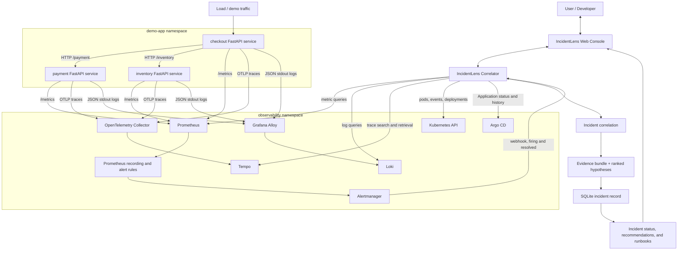

# IncidentLens Architecture

IncidentLens is a Kubernetes-based incident-intelligence demonstration. Its
correlator accepts Alertmanager notifications, gathers evidence from the live
observability and cluster APIs, ranks explainable hypotheses, persists the
incident, and serves the incident console from the same FastAPI service.



## Demo application layer

The `demo-app` namespace contains three FastAPI services: `checkout`,
`payment`, and `inventory`. Checkout makes synchronous HTTP requests to payment
and inventory, so a delay or failure in inventory can become a checkout latency
symptom. Each service exposes `/health` and Prometheus metrics; checkout also
exposes `/checkout`.

The deterministic latency demonstration changes `INVENTORY_DELAY_MS` through
the [inventory delay script](../chaos/03-inventory-delay.sh). The committed
deployment manifest has a healthy `0` millisecond default.

## Observability layer

Prometheus discovers the demo services through the
[ServiceMonitors](../apps/demo-app/k8s/servicemonitor.yaml) and scrapes their
`/metrics` endpoints. The IncidentLens PrometheusRule defines checkout request,
error-rate, availability, and p95 latency recordings, plus the
`CheckoutLatencySLOViolation` alert.

Each FastAPI service is instrumented with OpenTelemetry. It exports OTLP traces
to the OpenTelemetry Collector, which forwards them to Tempo. Structured JSON
logs are written to stdout with trace and span identifiers; Grafana Alloy
discovers `demo-app` pods, redacts authorization/cookie values, and forwards the
logs to Loki.

## Alerting layer

Prometheus evaluates the recording and alert rules. Alertmanager receives a
firing alert and forwards it to the correlator webhook. The repository-managed
AlertmanagerConfig lives in `demo-app`, which is required because the Prometheus
Operator scopes AlertmanagerConfig routes to their namespace. It uses
`sendResolved: true`, so resolved notifications are also sent when the alert
clears.

## Incident correlation layer

The correlator is a FastAPI service in `observability`. It accepts the
Alertmanager payload at `/webhook/alertmanager` and preserves `/webhook` as a
compatible path. It normalizes the alert, groups it by namespace/service,
deduplicates firing alerts during its configured time window, and persists the
result in SQLite.

For each new or updated firing incident, the correlator gathers an evidence
bundle and calls the rule-based hypothesis engine. Hypotheses are explicitly
evidence-backed: dependency slowdown requires trace evidence, deployment
hypotheses require a matching Argo CD deployment window, Kubernetes lifecycle
hypotheses use events/restarts, and metric hypotheses use Prometheus values.
This is explainable rule-based correlation, not a generated AI diagnosis.

## Evidence sources

The evidence bundle may include:

- Prometheus metric queries for request rate, error rate, p95 latency, target
  health, and restart count.
- Loki log excerpts scoped to the incident namespace and service.
- Tempo trace search, optional trace retrieval, and span-duration analysis.
- Kubernetes events, pod/container state, readiness, restart count, images,
  nodes, and deployment replicas.
- Argo CD Application sync/health state and deployment history.

Unavailable evidence sources are returned as bounded error information; an
unavailable Loki, Tempo, Kubernetes, or Argo CD dependency does not fail the
entire incident correlation request.

## GitOps and deployment evidence

The correlator reads the `incidentlens-demo` Argo CD Application through the
Kubernetes custom-object API. It records current revision, sync/health status,
and deployment history. The deployment-window function only flags a deployment
when its timestamp is within the configured window of the alert start time; it
does not fabricate causal attribution.

The current Argo CD Application points to the repository's demo-app manifests.
For a local recovery test, changes to the desired manifest need to be committed
and pushed to the branch Argo CD watches before its self-heal loop will retain
them.

## Incident persistence

Incidents are stored in SQLite on the correlator's persistent volume claim.
Records include the alert payload, fingerprint, grouping fields, status,
timestamps, evidence bundle, hypotheses, and optional analyst verdict. A
resolved notification updates the matching incident to `resolved`; a later
firing alert with the same fingerprint reopens the same record.

## Frontend incident console

The correlator serves a same-origin static web console from
`services/correlator/frontend`. The console calls `/healthz`, `/incidents`, and
`/incidents/{id}` directly, so it displays live persisted data rather than mock
incidents. It presents incident status, alert/service metadata, ranked
hypotheses, recommendations/runbooks, and source-specific evidence panels.

## Kubernetes deployment

The demo services run in `demo-app`; the correlator and observability stack run
in `observability`. The correlator uses a service account with read access to
the `demo-app` pods, events, and deployments needed for evidence collection. It
has readiness/liveness probes, a persistent data volume, resource requests and
limits, and a non-root security context. Webhook authentication can be enabled
with the optional `incidentlens-webhook-auth` Secret; no token is hardcoded.

## CI/CD

The correlator workflow compiles Python, installs pinned dependencies, runs unit
and service tests, validates Kubernetes/observability manifest documents, and
builds the correlator image. The demo-app workflow builds the application image,
runs Gitleaks and Trivy, and supports keyless signing on `main`. The Argo CD
Application is the GitOps delivery path for demo-app manifests.

## Incident and recovery flow

The verified firing flow is:

```text
traffic -> inventory degradation -> checkout latency metric -> Prometheus rule
-> Alertmanager -> correlator webhook -> evidence collection -> ranked
hypotheses -> SQLite incident -> IncidentLens web console
```

The intended recovery flow is:

```text
restore inventory -> checkout latency falls below the SLO -> Prometheus resolves
the alert -> Alertmanager sends a resolved notification -> correlator marks the
matching incident resolved -> console shows the updated status
```

The resolved-alert lifecycle is covered by service tests, but the final live
resolved-alert E2E verification remains pending. See the
[completion report](completion-report.md) for the exact verification record and
the Argo CD state that prevented the final recovery proof.
